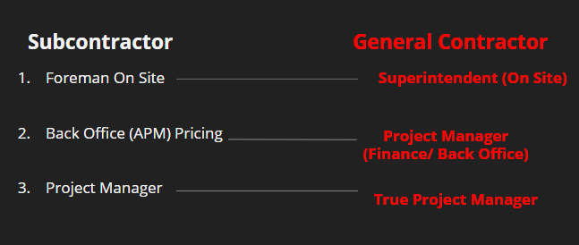
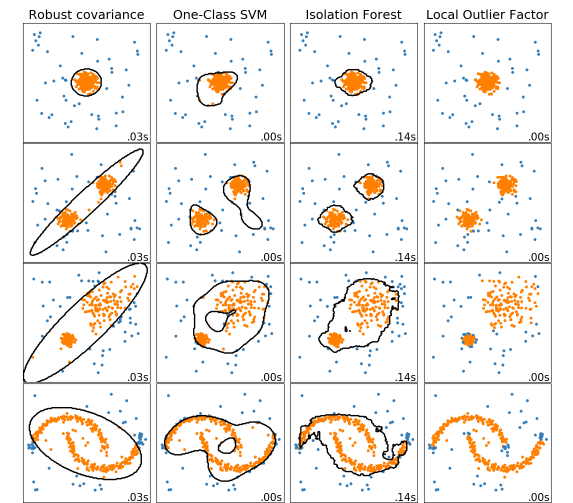
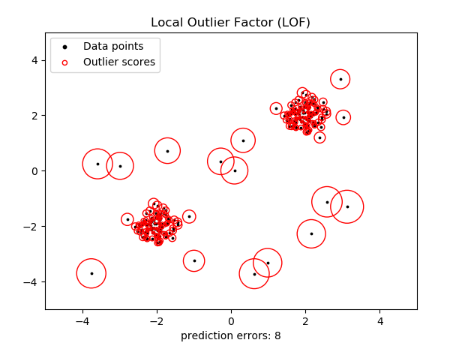

# Good Guys Developer Group
### George Smith, Jonathan Matos, Brian Kim & Carl Boitz
---

[Presentation](https://docs.google.com/presentation/d/1HTvjE3Lpj_gK-j8ycyKAu3bLvQA1haeJUFuT9r4qeNk/edit?usp=sharing)


[Selenium](#Selenium & API)

## Introduction to Construction

For our final project, we are taking a look at how we can apply machine learning to one of the oldest industries in the world, the construction industry. Real estate and construction have been the framework for the American Dream for hundreds of years, and  seamlessly evolved into one of the main facets of our economy. It has become so integral that homebuilding is one of the main barometers used to measure the health of the country. 

Although emerging technologies have improved some parts of the construction industry, there are still areas where emerging technologies are slow to be adopted.Everything from the bidding process, to the documentation is ripe for fintech to help this industry move into the forefront of the tech industry.

### Change Orders
When creating a contract between a developer and a contractor, a scope of work is defined. This is a detailed account of the work to be done and by whom in a certain amount of time. Unfortunately, there is always some unforeseen circumstance that can cause delays or end up adding to a cost previously unknown. If the laborers stopped working everytime something was ‘out of scope’ the project would never get finished, so construction contracts contain an allowance for change orders. These are amendments to the original contract that need to get done to complete the project, but also need to be paid for. While this is usually a paper ticket that needs to be accounted for later, recently the construction industry has been incorporating technology for documentation of these change orders. In addition to keeping a better log of these change orders, companies have also been able to record all the data from the change orders and store this information. We will be taking this data and seeing if we can use machine learning to help better predict the variance in cost associated with change orders. Using certain classification algorithms, we will see if we are able to analyze this data and bring value to developers by helping write better contracts.

   

With Machine Learning, we feel we can improve upon multiple aspects of the construction industry:
- Increase the accuracy of estimating
- Supporting faster estimation while using less resources
 - Helping detect fraudulent change orders or outliers


## Selenium & API
To obtain this data we consulted a small startup called [TracFlo](https://tracfloapp.com/) that collects change order data. From their database, we were able to use [Selenium](https://selenium-python.readthedocs.io/) to create a pipeline from their database to pull the information we needed.

```bash
$ git install Selenium
```


 WIll Fix later[API](Images/Selenium.gif)

 The main factors of information we pulled included:
- Total Cost of the change order
- The Labor type (Carpenter, Taper)
- Amount of Laborers
- Labor Rate
- Material Cost

[Selenium](eSelenium.ipynb)

--- 
## Scikit Learn 2.7 and Developing a Model to Detect Outliers

Using [Outlier Detection](https://scikit-learn.org/stable/modules/outlier_detection.html) we will be able to detect any outliers in the change orders. Based on the data we have obtained, we will use scikit learn to detect any change orders that are considered outliers based on the parameters we set. This will allow us to detect anomalies in the dataset. 




## Obtaining  the Data
Our first challenge was obtaining change order data. This data involves large sums of money as well as negotiation between two parties, so this data is also very sensitive. To try and form a third party database with this information would be unique in its value. The construction industry is very segmented, so aggregating this data from all the different companies is not only difficult, it may have never been documented before. 
This idea of applying a machine learning method to this data to detect fraudulent activity is novel but has taken another role in the construction industry as an Estimator. This is the expert on the field that has the experience and ability to eye a project and develop a cost estimate of time and materials. We are trying to take his job and apply a statistical approach to this information.


### Train, Test and Split
We were able to extract this data from the database and then split the data into training and testing data. After this we standardized the data by scaling it using StandardScalar.  This brought all our data onto a standard deviation scale and will allow us to detect a change order outside of a certain standard deviation. From here we are able build the model to allow us to take in new values and possibly flag fraudulent activity.

---

## Local Outlier Factor
With the dataset we have, we are able to set our boundaries for what we could consider normal inside the range of change orders. This allows us to set our frontier. With this classification, any new datasets coming into the subspace set by the frontier woud be considered in the same population as the initial observations. Anything outside of the subspace could be labelled abnormal with greater abnormality emphasized with the greater deviation.


 Signal Analysis